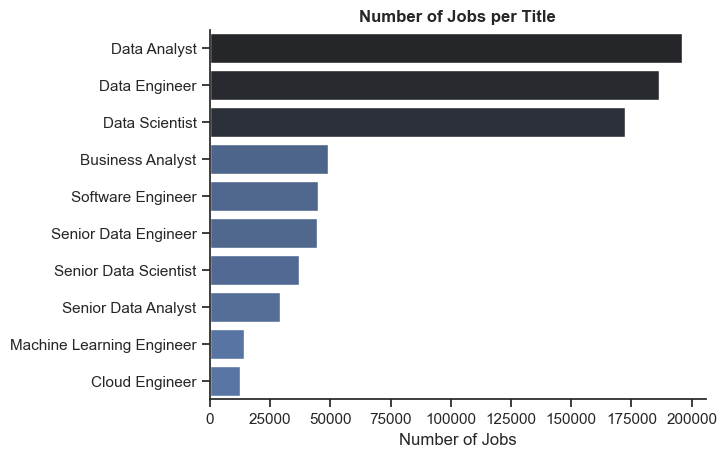
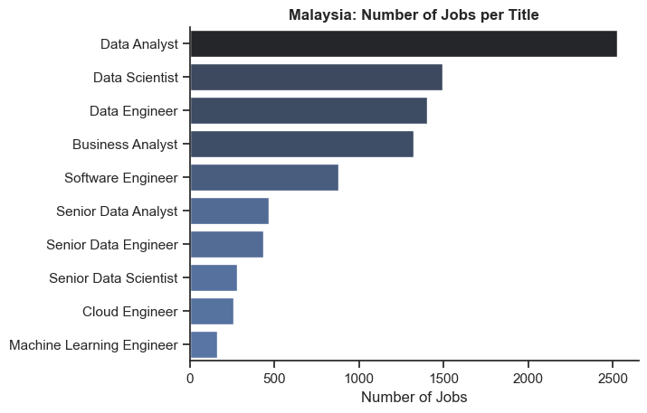
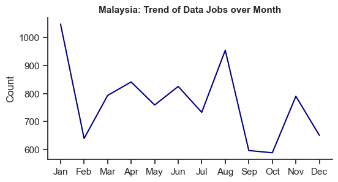
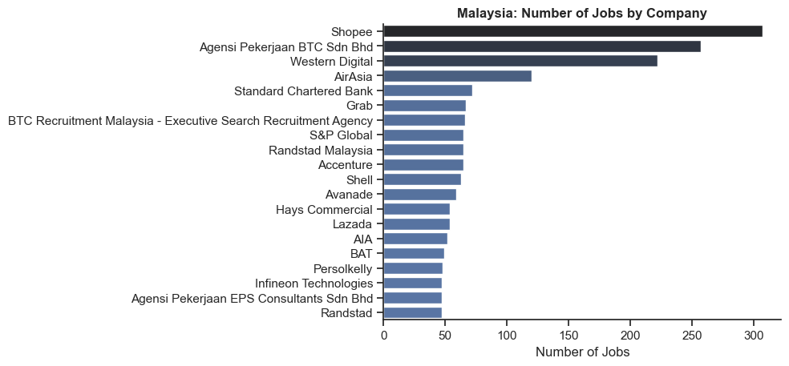
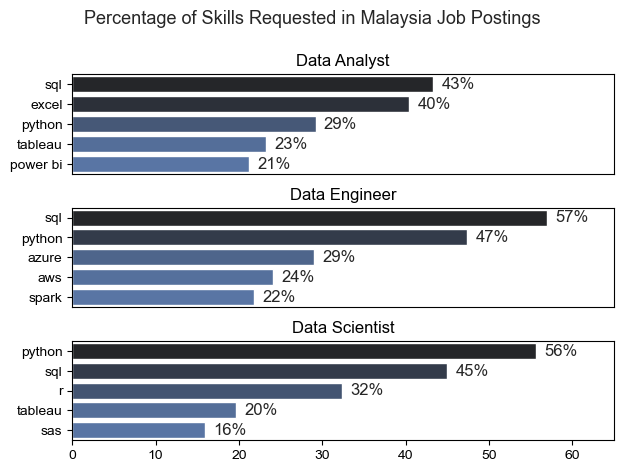
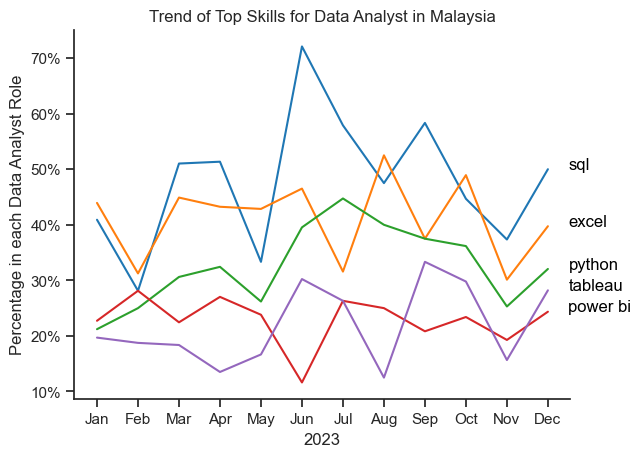
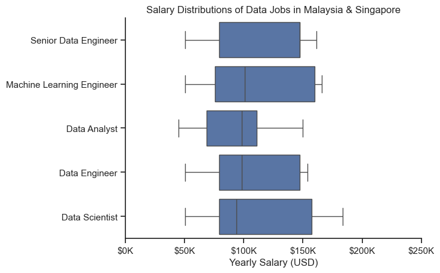
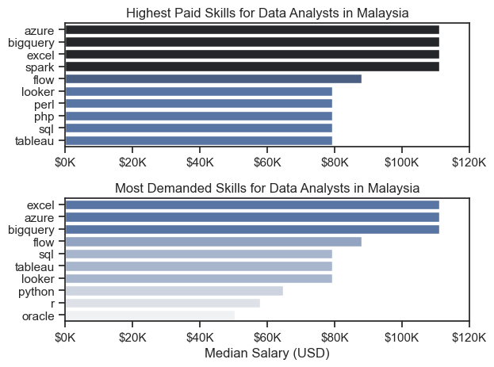
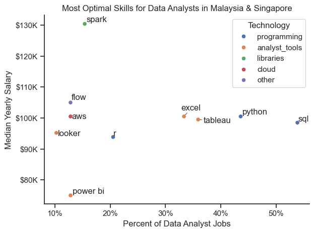

# Overview

This project is a Python data analysis project focused on data-related job roles, particularly analyzing trends in job postings, in-demand skills, and salary trends across different data roles.

The project idea and dataset source were based on and inspired by a tutorial video, which I followed as a way to revise and strengthen my Python data analysis and visualization skills while building a portfolio project.

Project inspiration/tutorial:
https://youtu.be/wUSDVGivd-8?si=-igaKpvzQgcEqxU1

# Questions
1. What are the most demanded skills for Top 3 Data Roles?  
2. How are in-demand skills trending for Data Analyst?  
3. How well do jobs and skills pay for Data Analyst?  
4. What is the most optimal skill to learn for Data Analyst? (High Demand AND High Paying)

# Tools Used
- **Python**  
    Python Libraries used: Pandas, Matplotlib, Seaborn
- **Jupyter Notebooks**
- **Visual Studio Code**
- **Git & GitHub**

# Data Preparation and Cleanup
## Filter MY and SG Jobs
To focus the analysis on the Malaysia job market, the dataset is filtered to include only roles based in Malaysia. However, due to the limited number of Data Analyst job postings in Malaysia for certain analyses and visualizations, Singapore data is also included.

# The Analysis
## Exploratory Data Analysis
Notebook for detailed steps: [1_EDA.ipynb](Data_Jobs/1_EDA.ipynb)

### Number of Data Roles Globally
```python
df_plot = df['job_title_short'].value_counts().to_frame()

sns.set_theme(style = 'ticks')
sns.barplot(data=df_plot, x='count', y='job_title_short', hue='count', palette='dark:b_r', legend=False)

sns.despine()
plt.title('Number of Jobs per Title', fontweight='bold')
plt.xlabel('Number of Jobs')
plt.ylabel('')
```


### Number of Data Roles in Malaysia
```python
df_plot_my = df_my['job_title_short'].value_counts().to_frame()

sns.set_theme(style = 'ticks')
sns.barplot(data=df_plot_my, x='count', y='job_title_short', hue='count', palette='dark:b_r', legend=False)

sns.despine()
plt.title('Malaysia: Number of Jobs per Title', fontweight='bold')
plt.xlabel('Number of Jobs')
plt.ylabel('')
```


#### Insights:
##### Global
Data Analyst has the highest demand globally (~200k postings), followed by Data Scientist (~180k) and Data Engineer (~175k). These three roles dominate the market, while most remaining data-related positions record fewer than 50k postings.

##### Malaysia
Malaysia shows a similar pattern, with Data Analyst leading (~2.5k postings), followed by Data Scientist (~1.6k), Data Engineer (~1.5k), and Business Analyst (~1.4k). Most other roles remain below 500 postings, suggesting a more concentrated demand around analytical and business-focused functions.

### Data Jobs Monthly Trends
```python
plt.figure(figsize=(6, 3)) 
sns.set_theme(style='ticks')

sns.lineplot(data=df_my_month, x='job_posted_month', y='Count', dashes=False, legend='full', color='darkblue')
sns.despine()
plt.legend().remove()
plt.title('Trend of Data Jobs in Malaysia', fontweight='bold')
plt.xlabel('')
plt.ylabel('Count')
```


#### Insights:
The trend is highly volatile as job postings drop sharply after January, recover gradually with fluctuations, and peak again in August. This is followed by a significant dip in September–October (lowest period), before a partial recovery toward November–December, suggesting possible mid-year hiring cycles and end-year slowdown.

### Companies with Most Data Roles in Malaysia
```python
df_plot_company_my = df_my['company_name'].value_counts().to_frame().head(20)

sns.set_theme(style='ticks')
sns.barplot(data=df_plot_company_my, x='count', y='company_name', hue='count', palette='dark:b_r', legend=False)

plt.title('Malaysia: Number of Jobs by Company', fontweight='bold')
plt.xlabel('Number of Jobs')
plt.ylabel('')
sns.despine()
```


## 1. What are the most demanded skills for Top 3 Data Roles?
The top five skills with the highest relative frequency were extracted for Data Analyst, Data Engineer, and Data Scientist roles to identify dominant skill patterns and cross-role differences.

Notebook for detailed steps: [2_Skill_Demand.ipynb](Data_Jobs/2_Skill_Demand.ipynb)

Top Skills for Data Roles in Malaysia
```python
fig,ax = plt.subplots(len(top3_job_titles), 1)

sns.set_theme(style='ticks')
for i, job_title in enumerate(top3_job_titles):
    df_plot = df_skills_perc[df_skills_perc['job_title_short'] == job_title].head(5)
    sns.barplot(data=df_plot, x='skill_percent', y='job_skills', ax=ax[i], hue='skill_count', palette='dark:b_r')
    ax[i].set_title(job_title)
    ax[i].set_ylabel('')
    ax[i].set_xlabel('')
    ax[i].get_legend().remove()
    ax[i].set_xlim(0, 65)
    # remove the x-axis tick labels for better readability
    if i != len(job_titles) - 1:
        ax[i].set_xticks([])

    # label the percentage on the bars
    for n, v in enumerate(df_plot['skill_percent']):
        ax[i].text(v + 1, n, f'{v:.0f}%', va='center')

fig.suptitle('Percentage of Skills Requested in Malaysia Job Postings', fontsize=13)
fig.tight_layout(h_pad=0.8)
```


### Insights:
- SQL is the most requested skill for Data Analysts and Data Engineers, appearing in around half of the job postings. For Data Scientists, SQL is the second sought-after skill.
- Data Engineers require cloud computing and data processing skills (e.g. Azure, AWS, and Spark), whereas Data Analysts and Data Scientists are more expected to have analytical and visualization tools (e.g. Excel, Tableau, Power BI, R, and SAS).
- Python is highly demanded across all three roles.

## 2. How are in-demand skills trending for Data Analyst?
Notebook for detailed steps: [3_Skill_Trend.ipynb](Data_Jobs/3_Skill_Trend.ipynb)

In-demand Skills Trend by Month 
```python
df_plot = df_da_my_percent.iloc[:, :5]
sns.lineplot(data=df_plot, dashes=False, legend='full', palette='tab10')
sns.set_theme(style='ticks')
sns.despine()

plt.title('Trend of Top Skills for Data Analyst in Malaysia')
plt.ylabel('Percentage in each Data Analyst Role')
plt.xlabel('2023')
plt.legend().remove()
plt.gca().yaxis.set_major_formatter(PercentFormatter(decimals=0))

# annotate the plot with the top 5 skills using plt.text()
for i in range(5):
    plt.text(12.5, df_plot.iloc[-1, i], df_plot.columns[i], color='black')
```


### Insights:
- SQL consistently dominated throughout 2023, peaking mid-year.
- Excel and Python showed relatively stable demand with minor fluctuations, remaining essential skills for data analysts.

## 3. How well do jobs and skills pay for Data Analyst? 
Notebook for detailed steps: [4_Salary_Analysis.ipynb](Data_Jobs/4_Salary_Analysis.ipynb)

*Analysis is done for data in MY and SG

Salary of Top 5 Data Roles in Malaysia & Singapore
```python
sns.boxplot(data=df_top5_my_sg, x='salary_year_avg', y='job_title_short', order=job_order_my_sg)
sns.set_theme(style='ticks')
sns.despine()

plt.title('Salary Distributions of Data Jobs in Malaysia & Singapore')
plt.xlabel('Yearly Salary (USD)')
plt.ylabel('')
plt.xlim(0, 250000) 
ticks_x = plt.FuncFormatter(lambda y, pos: f'${int(y/1000)}K')
plt.gca().xaxis.set_major_formatter(ticks_x)
```


Top Paid Skills and In-demand Skills Pay
```python
fig, ax = plt.subplots(2, 1)  

sns.set_theme(style='ticks')

# Top 10 Highest Paid Skills for Data Analysts
sns.barplot(data=df_da_my_top_pay, x='median', y=df_da_my_top_pay.index, hue='median', ax=ax[0], palette='dark:b_r')
ax[0].legend().remove()
ax[0].set_title('Highest Paid Skills for Data Analysts in Malaysia')
ax[0].set_ylabel('')
ax[0].set_xlabel('')
ax[0].xaxis.set_major_formatter(plt.FuncFormatter(lambda x, _: f'${int(x/1000)}K'))
ax[0].set_xlim(0, 120000)

# Top 10 Most Demanded Skills for Data Analysts')
sns.barplot(data=df_da_my_skills, x='median', y=df_da_my_skills.index, hue='median', ax=ax[1], palette='light:b')
ax[1].legend().remove()
ax[1].set_title('Most Demanded Skills for Data Analysts in Malaysia')
ax[1].set_ylabel('')
ax[1].set_xlabel('Median Salary (USD)')
ax[1].set_xlim(ax[0].get_xlim())  # Set the same x-axis limits as the first plot
ax[1].xaxis.set_major_formatter(plt.FuncFormatter(lambda x, _: f'${int(x/1000)}K'))

plt.tight_layout()
```


### Insights:
- The highest-paid and most in-demand skills for data analysts in Malaysia and Singapore are closely aligned, with Spark, Flow, and AWS appearing in both categories. This suggests that equipping these tools or skills can enhance both earning potential and job opportunities.

## 4. What is the most optimal skill to learn for Data Analyst? (High Demand AND High Paying)
Notebook for detailed steps: [5_Optimal_Skills.ipynb](Data_Jobs/5_Optimal_Skills.ipynb)

Skill by Salary and Data Analyst Roles Percentage

```python
sns.scatterplot(
    data=df_da_skills_tech_high_demand,
    x='skill_percent',
    y='median_salary',
    hue='technology'
)

sns.despine()
sns.set_theme(style='ticks')

texts = []
for i, txt in enumerate(df_da_skills_high_demand.index):
    texts.append(plt.text(df_da_skills_high_demand['skill_percent'].iloc[i], df_da_skills_high_demand['median_salary'].iloc[i], txt))

# Adjust text to avoid overlap
adjust_text(texts, arrowprops=dict(arrowstyle='->', color='gray'))

# Set axis labels, title, and legend
plt.xlabel('Percent of Data Analyst Jobs')
plt.ylabel('Median Yearly Salary')
plt.title('Most Optimal Skills for Data Analysts in Malaysia & Singapore')
plt.legend(title='Technology')

from matplotlib.ticker import PercentFormatter
ax = plt.gca()
ax.yaxis.set_major_formatter(plt.FuncFormatter(lambda y, pos: f'${int(y/1000)}K'))
ax.xaxis.set_major_formatter(PercentFormatter(decimals=0))

plt.tight_layout()
```


### Insights:
- Programming skills (blue), SQL and Python, appear in the largest portion of job postings, highlighting their strong demand among Data Analyst roles in Malaysia and Singapore.
- Library skills (green), such as Spark, command some of the highest median salaries (around $130K) despite being required in a relatively small proportion of postings (around 15%).
- Analytical tools (orange), including Excel and Tableau, offer a balance between market demand and salary levels for Data Analysts.

# Conclusion
**Market Trends**: 
- In Malaysia (2023), data job postings were lowest in February, September, and October, while demand peaked in January and August, indicating clear seasonal fluctuations in hiring activity.

**Skill Trends**:
- SQL emerges as the most critical and widely required skill across data roles, while role-specific differences exist between cloud/big data expertise for Data Engineers and analytical/visualization tools for Data Analysts and Data Scientists, with Python consistently serving as a common core competency across all positions.

**Skill Demand and Salary Correlation**: 
- The most required skills tend to fall within a mid-range median salary, rather than being the highest paid.
- Certain niche or specialised skills (e.g. Spark) show higher salary potential but appear less frequently in job postings, suggesting a trade-off between employment probability and compensation.
